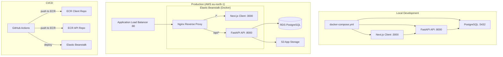

# Architecture

## System Overview

ECCC Hudson Bay Lowlands is a full-stack geospatial application for serving and managing Cloud Optimized GeoTIFF (COG) imagery of the Hudson Bay Lowlands region. The system combines a Next.js client, a FastAPI backend with TiTiler COG tile serving, and a PostgreSQL database, all deployed to AWS Elastic Beanstalk via a trunk-based CI/CD pipeline.

## High-Level Architecture



## Service Topology

### Local Development

Docker Compose orchestrates three services:

| Service | Image | Port | Purpose |
|---------|-------|------|---------|
| `eccc-db` | `postgis/postgis:16-3.4` | 5432 | PostgreSQL with PostGIS |
| `eccc-api` | Built from `api/Dockerfile` | 8000 | FastAPI backend |
| `eccc-client` | Built from `client/Dockerfile` | 3000 | Next.js frontend |

The client connects directly to the API at `http://localhost:8000`. No reverse proxy is used locally.

### Production (Elastic Beanstalk)

Production uses `docker-compose.prod.yml` with pre-built ECR images and an Nginx reverse proxy:

| Service | Image Source | Port | Purpose |
|---------|-------------|------|---------|
| `nginx` | `nginx` (official) | 80 | Reverse proxy routing |
| `client` | ECR client repository | 3000 | Next.js frontend |
| `api` | ECR API repository | 8000 | FastAPI backend |

Nginx routes `/*` to the client and `/api/*` to the API (stripping the `/api` prefix). The API sets `ROOT_PATH=/api` so OpenAPI docs generate correct URLs behind the proxy.

The database runs on a separate RDS instance (not in Docker).

## Request Flow

**Client page request (production):**
1. Browser request hits ALB on port 80
2. ALB forwards to Nginx
3. Nginx matches `location /` and proxies to Next.js on port 3000
4. Next.js returns rendered page

**API request (production):**
1. Browser/client sends request to `/api/layers`
2. Nginx matches `location /api/` and rewrites to `/layers`
3. Nginx proxies to FastAPI on port 8000
4. FastAPI processes request, queries PostgreSQL, returns JSON

**Health check cascade:**
1. ALB health check hits Nginx at `/health`
2. Nginx proxies to Next.js `/health` route
3. Next.js health route calls FastAPI `/health` endpoint
4. FastAPI health endpoint runs `SELECT 1` against the database
5. Aggregated status returns: client, API, and database health

## Technology Stack

| Component | Technology | Version | Purpose |
|-----------|-----------|---------|---------|
| Client | Next.js | 16.1.6 | React framework with SSR |
| Client runtime | Node.js | 24.13.0 | JavaScript runtime |
| Client package manager | pnpm | 10.20.0 | Dependency management |
| Client i18n | next-intl | 4.7.0 | Internationalization (separate from API i18n) |
| UI styling | Tailwind CSS | 4.x | Utility-first CSS |
| API framework | FastAPI | latest | Python web framework |
| Tile serving | TiTiler Core | 1.1.0 | COG tile serving |
| Python | Python | 3.11+ | API runtime |
| Python package manager | uv | latest | Dependency management |
| ORM | SQLAlchemy | 2.0+ | Database ORM with type annotations |
| DB driver | psycopg | 3.0+ | PostgreSQL adapter (binary for performance) |
| Database | PostgreSQL + PostGIS | 16 / 3.4 | Relational database with spatial extensions |
| Spatial ORM | GeoAlchemy2 | 0.15+ | SQLAlchemy PostGIS integration |
| Geometric ops | Shapely | 2.0+ | Geometry validation, bbox, serialization |
| CRS transforms | pyproj | 3.6+ | Coordinate reference system transformations |
| Data validation | Pydantic | 2.0+ | Request/response schema validation with i18n support |
| Linting (API) | Ruff | latest | Python linter/formatter |
| Linting (Client) | Biome | latest | JS/TS linter/formatter |
| Infrastructure | Terraform | 1.14.3 | Infrastructure as code |
| Cloud provider | AWS | eu-north-1 | Hosting |
| Container registry | Amazon ECR | - | Docker image storage |
| Deployment | Elastic Beanstalk | Docker platform | Container orchestration |
| Reverse proxy | Nginx | latest | Request routing |
| CI/CD | GitHub Actions | - | Automated pipelines |
| E2E testing | Playwright | latest | Browser testing |

## Repository Structure

```
eccc-hudson-bay-lowlands/
|-- api/                        # FastAPI backend application
|   |-- main.py                 # Application entry point
|   |-- config.py               # Settings (pydantic-settings)
|   |-- Dockerfile              # Multi-stage Python build
|   |-- pyproject.toml          # Dependencies and tooling config
|   |-- db/                     # Database engine and session
|   |-- models/                 # SQLAlchemy ORM models
|   |-- schemas/                # Pydantic request/response schemas
|   |-- routers/                # API endpoint handlers
|   |-- services/               # Business logic layer
|   +-- tests/                  # pytest test suite
|-- client/                     # Next.js frontend application
|   |-- src/app/                # App Router pages and routes
|   |-- Dockerfile              # Multi-stage Node.js build
|   +-- package.json            # Dependencies
|-- infrastructure/             # Terraform AWS infrastructure
|   |-- main.tf                 # Root module
|   |-- modules/                # Reusable Terraform modules
|   |-- source_bundle/          # Beanstalk deployment bundle
|   +-- vars/                   # Variable files
|-- docker/                     # Docker utilities
|   +-- init-db.sh              # Database initialization script
|-- e2e/                        # Playwright end-to-end tests
|-- data-processing/            # Data processing utilities
|-- docs/                       # Project documentation
|-- .github/workflows/          # CI/CD pipeline definitions
+-- docker-compose.yml          # Local development services
```

## Key Design Decisions

| Decision | Rationale | ADR |
|----------|-----------|-----|
| PostGIS for spatial storage | Native spatial indexing and queries; SRID 4326 canonical storage | [ADR-001](ADR/001-postgis-spatial-storage.md) |
| TiTiler for COG tile serving | Provides standards-compliant tile serving without custom tile generation code | [ADR-002](ADR/002-titiler-cog-serving.md) |
| EPSG:6933 for area computation | Global equal-area projection for accurate area validation | [ADR-003](ADR/003-epsg6933-area-computation.md) |
| Three-level hierarchy: Category > Dataset > Layer | Categories group datasets thematically; datasets group related layers; mirrors domain structure | - |
| i18n via field-first JSONB metadata | Each field (title, description) holds `{en, fr}` translations; no JOINs; flexible to add fields or languages | - |
| Layer model (renamed from Raster) | Domain-neutral name supports raster, vector, tiles, WMS; aligns with GIS industry terminology | - |
| Dataset model (replaces Location) | Provides grouping for related layers via 1:N relationship; semantically cleaner than Location | - |
| Category model (new) | Top-level thematic grouping (e.g., "Climate", "Land Cover"); 1:N relationship to datasets | - |
| `metadata_` mapped to `metadata` column | Avoids collision with SQLAlchemy `Base.metadata`; clean Pydantic access | - |
| Cascade delete: Category > Dataset > Layer | Deleting a category removes its datasets and their layers; maintains referential integrity | - |
| Trunk-based deployment | Single main branch with automated deploy simplifies release process | - |
| Nginx reverse proxy in production | Unified entry point; client and API share a single domain | - |
| Multi-stage Docker builds | Minimizes production image size; separates build and runtime dependencies | - |
| Standalone Next.js output | Optimized for Docker deployments; self-contained server | - |
| `NEXT_PUBLIC_*` as build args | Environment-specific values embedded at build time for client-side access | - |
| SQLAlchemy 2.0+ with psycopg v3 | Modern async-ready ORM with type-annotated syntax and latest PostgreSQL driver | - |
| Auto table creation via lifespan | Simple schema management for early-stage project; Alembic planned for future | - |

## Related Documentation

- [Getting Started](GETTING_STARTED.md) -- setup guide for new developers
- [Environment Variables](ENVIRONMENT_VARIABLES.md) -- all configuration variables
- [Database](DATABASE.md) -- schema reference and spatial data patterns
- [Deployment](DEPLOYMENT.md) -- deployment guide and runbook
- [Infrastructure README](../infrastructure/README.md) -- Terraform module details
