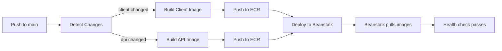

# Deployment

Guide for deploying the ECCC Hudson Bay Lowlands application to AWS.

## Deployment Architecture

The project uses trunk-based deployment: every push to `main` that touches application or infrastructure code triggers an automated deployment to the `dev` environment on AWS Elastic Beanstalk.



## Automated Deployment Flow

When code is pushed to `main`, the **Deploy Trunk** workflow (`.github/workflows/deploy-trunk.yml`) runs:

### 1. Change detection

The `trigger_build` job uses `dorny/paths-filter` to determine which components changed. Only changed components are rebuilt.

### 2. Build images

- **Client**: Builds `client/Dockerfile` with build args (`NEXT_PUBLIC_API_URL`, `NEXT_PUBLIC_MAPBOX_API_TOKEN`) and pushes to ECR with tags `<sha>` and `dev`.
- **API**: Builds `api/Dockerfile` (no build args needed; API uses runtime env vars) and pushes to ECR with tags `<sha>` and `dev`.

Both builds use GitHub Actions cache for Docker layer caching.

### 3. Deploy

The `deploy` job:
1. Creates a `.env` file from GitHub Secrets and Variables
2. Copies `docker-compose.prod.yml` to `docker-compose.yml`
3. Packages `docker-compose.yml`, `.env`, `proxy/` (Nginx config), and `.ebextensions/` into `deploy.zip`
4. Deploys to Elastic Beanstalk using `einaregilsson/beanstalk-deploy@v22`
5. Beanstalk pulls the `dev`-tagged images from ECR and starts the services

### 4. Verification

Beanstalk performs health checks against `/health` via the ALB. The health check cascades: Nginx -> Next.js -> FastAPI -> PostgreSQL. If any service is unhealthy, the deployment is flagged as degraded.

## Manual Deployment

The workflow supports `workflow_dispatch` for manual triggers:

1. Go to Actions > Deploy Trunk in the GitHub repository
2. Click "Run workflow"
3. Select the `main` branch
4. Click "Run workflow"

Manual dispatch always rebuilds both client and API images regardless of file changes.

## Path Filters

Automated deployments trigger only when these paths change:

| Path | Triggers |
|------|----------|
| `client/**` | Client image build |
| `api/**` | API image build |
| `.github/workflows/*` | Both builds |
| `infrastructure/**` | Deployment |
| `package.json` | Deployment |

## Monitoring

### Deployment status

- **GitHub Actions**: Check the Actions tab for workflow run status
- **AWS Console**: Elastic Beanstalk > Environments > `<project>-dev-env` for environment health
- **Beanstalk logs**: Available in the AWS Console under Logs, or via CLI:

```bash
aws elasticbeanstalk request-environment-info \
  --environment-name eccc-hudson-bay-lowlands-dev-env \
  --info-type tail \
  --profile aws-eccc
```

### Health check endpoints

| Environment | URL |
|-------------|-----|
| Local | http://localhost:8000/health |
| Production | `<beanstalk-cname>/health` (via Nginx -> Next.js -> API) |

## Rollback

To rollback to a previous version:

1. Go to AWS Console > Elastic Beanstalk > Application versions
2. Find the previous version (labeled with commit SHA)
3. Select it and click "Deploy"

Or via CLI:

```bash
aws elasticbeanstalk update-environment \
  --environment-name eccc-hudson-bay-lowlands-dev-env \
  --version-label <previous-version-label> \
  --profile aws-eccc
```

## Setting Up GitHub Secrets

For a new repository or environment, configure these in GitHub Settings > Secrets and variables > Actions:

### Secrets (required)

1. `PIPELINE_USER_ACCESS_KEY_ID` -- AWS access key for the CI/CD IAM user
2. `PIPELINE_USER_SECRET_ACCESS_KEY` -- AWS secret key for the CI/CD IAM user
3. `AWS_REGION` -- AWS region (e.g., `eu-north-1`)
4. `CLIENT_REPOSITORY_NAME` -- ECR repository name for client images
5. `API_REPOSITORY_NAME` -- ECR repository name for API images
6. `PROJECT_NAME` -- Project name (used in Beanstalk naming: `<name>-dev`, `<name>-dev-env`)
7. `DB_HOST` -- RDS instance hostname
8. `DB_PORT` -- Database port (typically `5432`)
9. `DB_NAME` -- Database name (e.g., `eccc_db`)
10. `DB_USERNAME` -- Database username
11. `DB_PASSWORD` -- Database password
12. `S3_BUCKET_NAME` -- Application S3 bucket name
13. `NEXTAUTH_SECRET` -- Secret for NextAuth.js token signing

### Variables (required)

1. `NEXT_PUBLIC_API_URL` -- Production API URL (embedded in client at build time)
2. `NEXT_PUBLIC_MAPBOX_API_TOKEN` -- Mapbox token (embedded in client at build time)
3. `NEXTAUTH_URL` -- Production URL for NextAuth.js

### Environment

All secrets and variables use the `dev` GitHub environment. Create this environment in Settings > Environments before the first deployment.

## Troubleshooting

### Build fails: "Error: Cannot connect to ECR"

- Verify `PIPELINE_USER_ACCESS_KEY_ID` and `PIPELINE_USER_SECRET_ACCESS_KEY` are correct
- Ensure the IAM user has ECR push/pull permissions
- Check that `AWS_REGION` matches the ECR repository region

### Deploy fails: "No application versions available"

- The deploy job depends on at least one build job succeeding
- Check if the build jobs were skipped (no matching path changes) and use manual dispatch to force a rebuild

### Beanstalk environment shows "Degraded"

- Check Beanstalk environment logs for container startup errors
- Verify database connectivity: is `DB_HOST` correct and is the RDS instance running?
- Check security groups allow traffic from Beanstalk EC2 instances to RDS

### Health check failing

- The ALB health check path is `/health`
- This routes through Nginx to Next.js, which cascades to FastAPI
- Check each service individually:
  - Nginx: Are `proxy/conf.d/default.conf` routes correct?
  - Client: Is the Next.js health route responding?
  - API: Can FastAPI reach the database?

### Client shows wrong API URL

- `NEXT_PUBLIC_API_URL` is embedded at build time
- If you changed the variable, you must rebuild and redeploy the client image
- Verify the variable is set correctly in GitHub Variables (not Secrets)

## CI Pipelines (Pull Requests)

Separate CI workflows run on pull requests for validation only (no deployment):

| Workflow | Trigger | Jobs |
|----------|---------|------|
| API CI | `api/**` changes | lint, test, docker-build |
| Client CI | `client/**` changes | docker-build |
| E2E Tests | `api/**`, `client/**`, `e2e/**` changes | Playwright E2E tests |

See `.github/workflows/` for full workflow definitions.

## Related Documentation

- [Architecture](ARCHITECTURE.md) -- system topology and request flow
- [Environment Variables](ENVIRONMENT_VARIABLES.md) -- all secrets and variables
- [Infrastructure README](../infrastructure/README.md) -- Terraform module details
